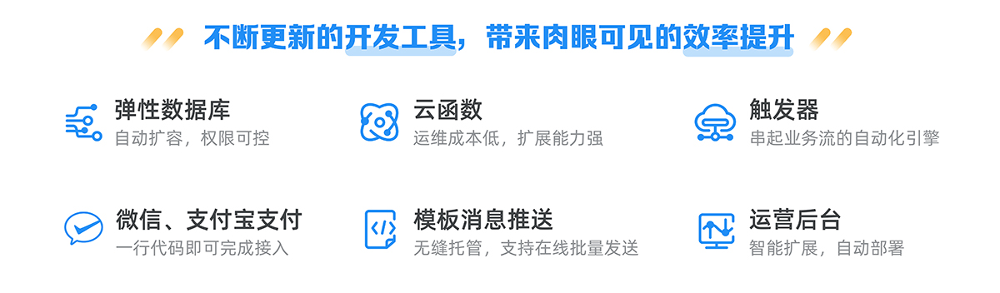

# 知晓云 - 小程序开发快人一步

[知晓云](https://cloud.minapp.com/)是国内首家专注于小程序开发的后端云服务，为以小程序为代表的大前端开发者提供最低门槛的 Serverless 无服务架构接入体验。

它免去了小程序等大前端开发中服务器搭建、域名备案、数据接口实现等繁琐流程。让开发者专注于业务逻辑的实现，使用知晓云开发小程序、app、网站，门槛更低，效率更高。

* 小程序云：各大小程序平台功能定制化支持，开箱即用
* 全平台：跨终端支持，可同时关联小程序、iOS、网页等多个平台
* 极速开发：轻量级 SDK，两行代码即可完成接入
* 高效稳定：弹性结构，自动扩容，轻松应对大流量
* 知晓推送：融合全平台模板消息推送服务，精准触达用户
* iBeacon 室内外定位导航：远超国际标准，室内定位精度在 2 米内的 LBS 服务
* 小电商：开箱即用，拿来即用的 SaaS 电商小程序
* 跨境支付：支持跨境收款，轻松完成业务出海
* 小游戏：利用知晓云提供的核心组件，轻松实现小游戏





## 文档

* [SDK 使用文档](https://doc.minapp.com/)
* [SDK api 文档](https://ifanrx.github.io/hydrogen-js-sdk-api-doc/)

## 目录结构

```
├── CHANGELOG.md
├── README.md
├── core                      // 核心模块，所有跨平台的通用方法
├── docs                      // api 接口文档
├── index.d.ts
├── jsdoc-configs             // jsdoc 配置
├── lib
├── node_modules
├── package.json
├── scripts                   // 脚本。例如 baas.d.ts 的生成脚本
├── sdk-file                  // 各个平台的接口与入口文件
├── sdk-plugin                // sdk 微信小程序插件版
├── test                      // 单元测试
├── types                     // TypeScript 类型定义与单元测试
└── yarn.lock
```

## 贡献

### 开发流程

* `yarn install` 安装依赖
* 以 `sdk-file/webpack/copyFilesForDev.default.js` 为模版，在同一目录下创建 `sdk-file/webpack/copyFilesForDev.local.js` 文件，并在文件中做相应的配置。webpack 在每次 build 完之后，会使用该配置，将特定的 sdk 文件复制到特定的目录，用于各个平台应用的集成测试。
* `npm run dev`
* 开发、测试并提交代码
* [SDK 使用文档](https://github.com/ifanrx/hydrogen-sdk-doc) 中添加对应的内容
* PR ( SDK 与文档共两个 PR )

### 代码提交规范

* 由于 baas.d.ts 是通过 jsdoc 注释生成的，所以所有提供给用户调用的接口必须添加 jsdoc 注释。并在 `types/test/` 目录中添加对应的单元测试。
* 内部方法的注释可以使用以下两种方式：

  * ```
    /*
     * 注释
     */
    ```

  * ```
    /**
     * 注释
     * @private
     */
    ```

* 代码中的逻辑部分需要写单元测试，后端接口调用部分不需要单元测试（这部分由集成测试应用来完成）。
* 提交代码前，需要 `npm run lint`
