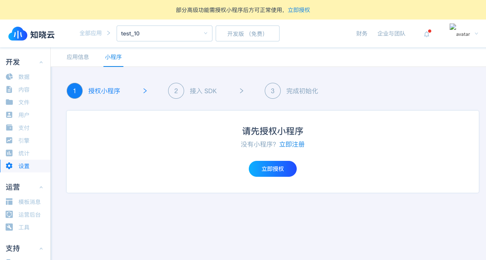
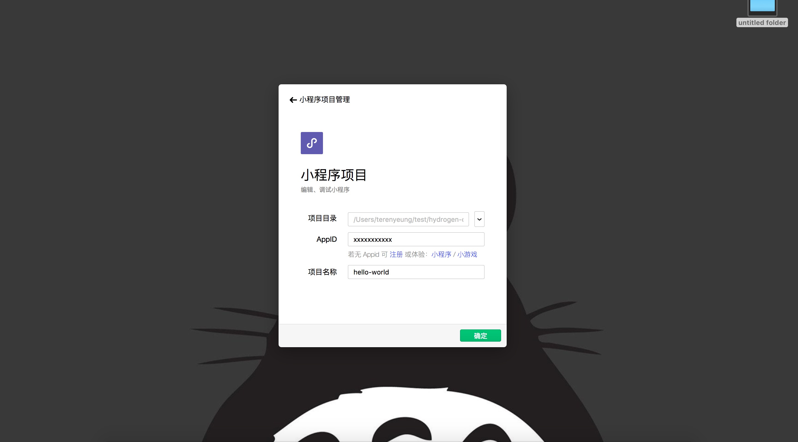
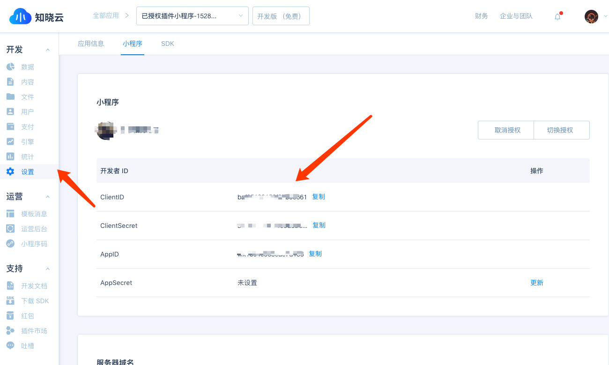
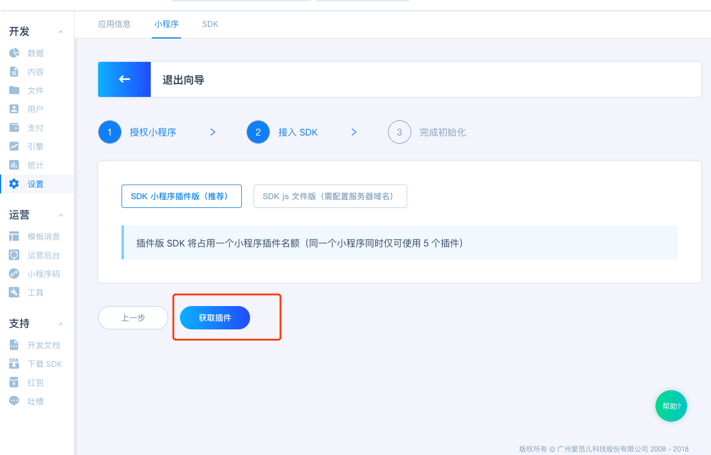
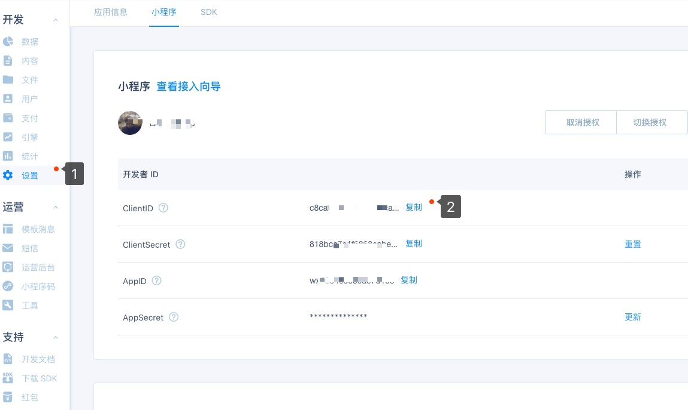
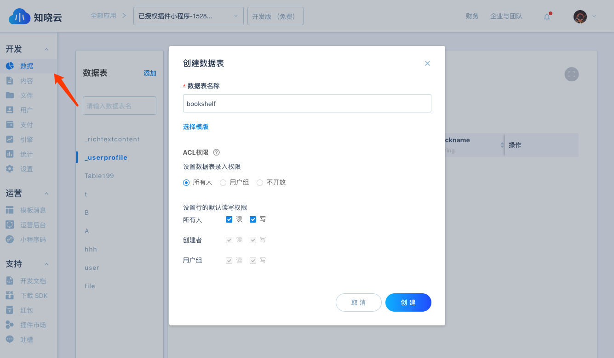
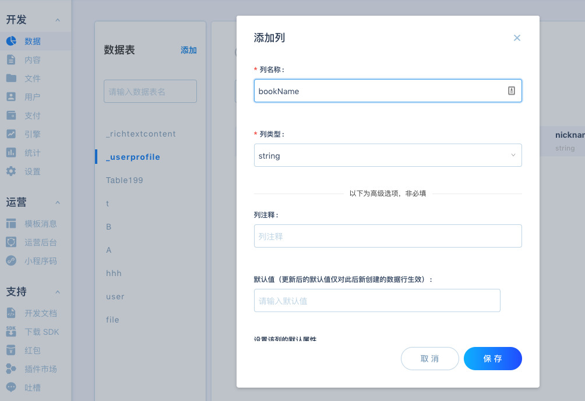
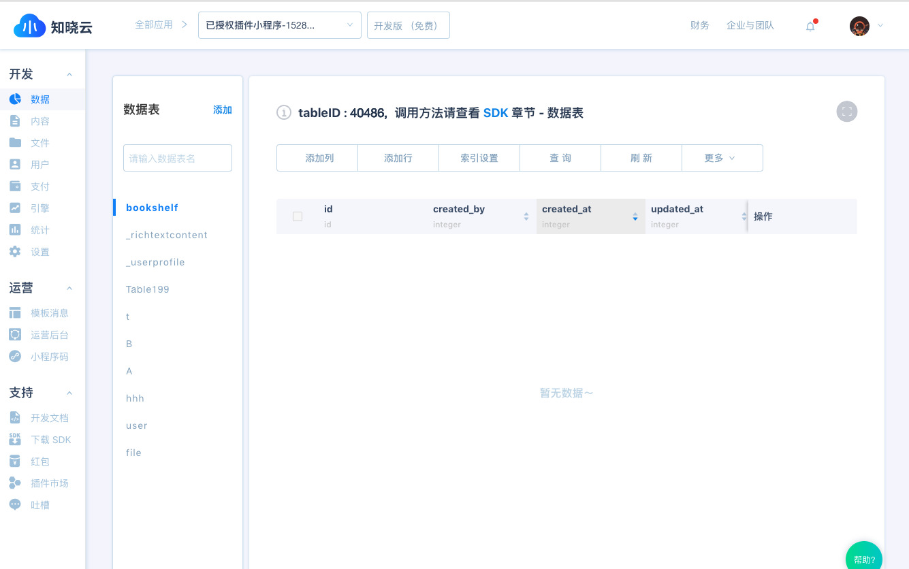

# 知晓云

知晓云是个好用、顺手的小程序开发工具。它免去了小程序开发中服务器搭建、域名备案、数据接口实现等繁琐流程。让您专注于业务逻辑的实现，使用知晓云开发小程序，门槛更低，效率更高。

# 新手入门

**新手入门**章节将会带领大家如何**从零开始**将知晓云接入小程序中。

在本章节中，你将会学到以下内容：

- 小程序注册指引

- 知晓云账号注册

- 创建第一个接入知晓云的小程序

## 小程序注册指引

在使用**知晓云**之前，请先确保按照微信官方指引完成[小程序注册流程](https://mp.weixin.qq.com/)。

## 知晓云账号注册

开发者在微信公众平台申请到自己的小程序后，接下来就可注册并获取知晓云账号，完成相关信息绑定与服务配置后，即可使用知晓云提供的后端服务。

### 注册并完成相关信息绑定

前往知晓云 (https://cloud.minapp.com/) 注册知晓云账号。

成功注册后，页面将跳转至控制台，需要用户进一步完成**邮箱激活验证**和**企业信息设置**等步骤。

完成以上步骤，即可进入知晓云 dashboard 页。

> 如果注册或邮件激活失败，请开发者根据失败提示进行后续操作。如果开发者认为是服务提供方方面导致的失败，请邮件联系 `mincloud@ifanr.com`，我们会第一时间处理您的邮件。

### 小程序第三方授权以及服务器域名配置

为了使用知晓云提供的后端服务，进入 dashboard 后，开发者首先需要为知晓云授权。

知晓云在设置模块提供了**一键授权**功能，用户只需点击**立即授权**并在新开授权回调页完成授权即可。




## 第一个接入知晓云的小程序

下面，我们以**我的书架**小程序 demo 为例，创建第一个接入知晓云的小程序。

### 1、 知晓云的初始化配置

首先，打开[微信开发者工具](https://mp.weixin.qq.com/debug/wxadoc/dev/devtools/download.html?t=201822)，将先前下载好的演示 [demo](https://github.com/ifanrx/hydrogen-demo.git) 的 `hello-world` 文件夹添加入小程序项目中。



其中 `AppID` 为小程序的 ID，在微信小程序后台**设置 >> 开发设置** 中可获取，知晓云也在**设置模块的小程序面板** (https://cloud.minapp.com/dashboard/#/app/settings/app/) 提供了快速通道获取小程序 ID。



#### 在 app.json 中加入插件的引用声明

> 插件版 sdk 1.5.1 以上需小程序基础库 2.1.0 及以上。

```json
{
  "plugins": {
      "sdkPlugin": {
        "version": "1.10.0",
        "provider": "wxc6b86e382a1e3294"
   }
  }
}
```


##### 在 app.js 文件中完成 SDK 的初始化

通过初始化 SDK，知晓云服务可以验证当前的小程序是否是有效合法的，只有通过验证的小程序才能使用 SDK 提供的全部功能。

在知晓云后台 - **设置模块的小程序面板** (https://cloud.minapp.com/dashboard/#/app/settings/app/) ，可获取要接入知晓云服务的小程序 `ClientID`, 按照如下方式进行 SDK 初始化:



```js
// app.js
App({
  onLaunch: function() {
    wx.BaaS = requirePlugin('sdkPlugin')
    //让插件帮助完成登录、支付等功能
    wx.BaaS.wxExtend(wx.login,
     wx.getUserInfo,
     wx.requestPayment)

    let clientID = '知晓云管理后台获取到的 ClientID'
    wx.BaaS.init(clientID)
  }
})
    
```

### 2、创建数据表

完成知晓云的初始化配置后，开发者就可以根据自身应用的业务逻辑，确定所需的数据表，确定好后即可在**知晓云后台 >> 数据管理模块**开始数据表的创建工作。

以**我的书架**为例，在数据管理模块，创建一张名为 `bookshelf` 的数据表，并添加一个名为 `bookName` 的数据列。





### 3、SDK 数据操作接口使用示例

完成数据表的创建后，我们现在就可以使用知晓云的数据管理模块的功能，对数据进行 CRUD 操作。

**创建第一本书**

```js
// pages/index.js
Page({
  data: {
    creatingBookName: '',
  },

  // 绑定添加书目的提交按钮点击事件，向服务器发送数据
  createBook(e) {
    let bookName = this.data.creatingBookName // 缓存在 data 对象中的输入框输入的书名
    let tableID = '1' // 从知晓云后台的数据表中获取到的对应数据表的 ID
    let Books = new wx.BaaS.TableObject(tableID) //实例化对应 tableID 的数据表对象
    let book = Books.create() // 创建一条记录

  // 调用创建数据项接口，进行数据的持久化存储，详见：https://doc.minapp.com/js-sdk/schema/create-record.html
    book.set({bookName})
      .save()
      .then(() => {
        //...
      })
  }
})
```

> 注意，上述代码可能和 `hello-world` 源码有一定的差异，但是代码的逻辑和接口的调用方式基本上是一样。

同时，我们可以在数据管理模块看到新增的数据项。



至于更新书名和删除书籍等操作，其接口调用过程大致和创建书籍一样，这里就不再赘述，详见[**演示 demo**](https://github.com/ifanrx/hydrogen-demo.git)的源码。

## 更多

我们在本章节中，带领大家从零开始完成了知晓云接入小程序的基本流程。

了解到去哪里注册小程序、知晓云的注册以及相关信息的绑定与授权，并引导大家快速搭建起一个采用知晓云作为后端服务的小程序。

至此，我们就可以基于以上的基本概念，在接下来的小程序开发中实现开发效率的显著提升。

请复制右侧网址 *https://doc.minapp.com/*， 粘贴到浏览器地址栏中打开，查看更多教程。
